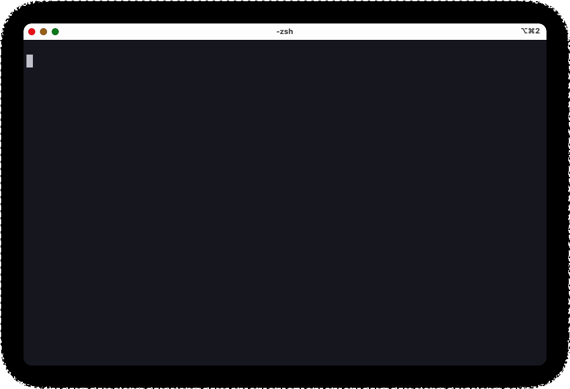
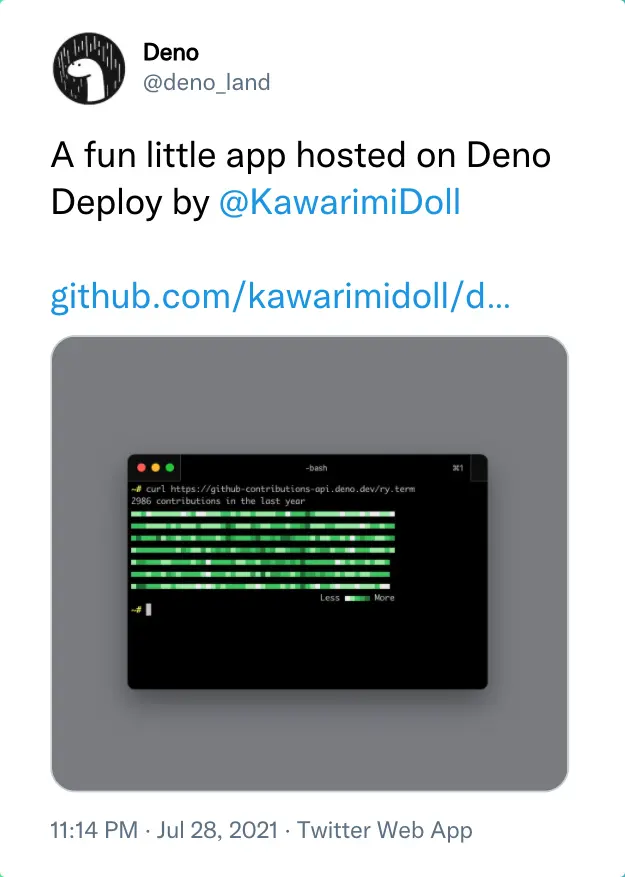

# deno-github-contributions-api

[](https://jsr.io/@kawarimidoll/github-contributions-api)
[](https://jsr.io/@kawarimidoll/github-contributions-api)
[](.github/workflows/ci.yml)
[](https://github-contributions-api.deno.dev)
[](LICENSE)

Fetch and render GitHub contributions data as JSON, SVG, terminal text, or plain text.



## Usage

### As an API

In your terminal:

```
$ curl https://github-contributions-api.deno.dev
# Then follow the messages...
```

Of course, you can access the endpoint from the web browser:
https://github-contributions-api.deno.dev

### As a library

```ts
import { getContributions } from "jsr:@kawarimidoll/github-contributions-api";

const contributions = await getContributions("username", "ghp_token");

console.log(contributions.toTerm({ scheme: "random" }));
// Also available: toJson(), toText(), toSvg()
```

You can also specify a date range with `from` / `to` options.

A personal access token with the `read:user` scope is required.
Generate one here: https://github.com/settings/tokens/new

## Local Development

1. Copy `.envrc.example` to `.envrc` and set your GitHub personal access token:

```sh
cp .envrc.example .envrc
# Edit .envrc and set your token
```

2. Load environment variables with [direnv](https://direnv.net/):

```sh
direnv allow
```

3. Start the development server:

```sh
deno task dev
```

## Extra

If you are using [GitHub CLI](https://github.com/cli/cli), you can call this API
from [gh-graph](https://github.com/kawarimidoll/gh-graph).

<details>
  <summary>Acknowledgements</summary>
  <a href="https://twitter.com/deno_land/status/1420387162206478340">
    
  </a>
</details>

---

```ts
if (this.repo.isAwesome || this.repo.isHelpful) {
  star(this.repo);
}
```

<!-- this part is inspired by https://github.com/bhumijgupta/Deno-news-cli -->
